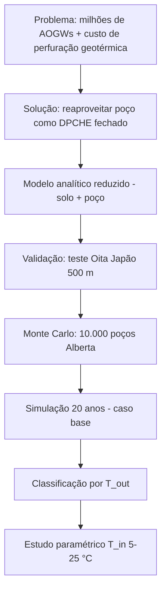

---
tags:
  - note
  - geoenergia
  - artigo
  - AOGW
  - Alberta
---
06/06/2026 - 10:18

### ~={Titulo}Assessment of geothermal energy potential from abandoned oil and gas wells in Alberta, Canada=~

~={blue}**Fonte**=~: Zolfagharroshan et al., *Applied Energy* **375** (2024) 124103 — [PDF](../02-Referencias/Assessment%20of%20geothermal%20energy%20potential%20from%20abandoned%20oil%20and%20gas%20wells.pdf)

~={cyan}**Ideia central em uma frase**=~: os autores desenvolvem um **modelo analítico acoplado solo-poço** (configuração [[Coaxial double pipe DBHE|DPCHE coaxial]]), validam com teste de campo no Japão e usam **Monte Carlo com 10.000 poços** representativos de Alberta para estimar, em **20 anos**, quantos [[AOGWs]] têm potencial geotérmico e para que aplicação (eletricidade via [[Organic Rankine Cycle (ORC)|ORC]] ou aquecimento).

#### ~={Titulo}Mapa mental do artigo=~



___

### ~={Titulo}1. Resumo (Abstract) — o que o artigo promete=~

| Elemento         | Conteúdo                                                                                                      |
| ---------------- | ------------------------------------------------------------------------------------------------------------- |
| **Objeto**       | Potencial geotérmico de [[AOGWs]] na província de **Alberta, Canadá**                                         |
| **Configuração** | [[Coaxial double pipe DBHE]] — fluido frio desce pelo **anular**, retorna pelo **tubo central isolado** (CXA) |
| **Modelo**       | Conjugado (solo + poço), **transiente**, analítico de ordem reduzida                                          |
| **Validação**    | Teste piloto em poço geotérmico fechado (Oita, Japão)                                                         |
| **Estatística**  | **10.000 amostras Monte Carlo** → 50.000 simulações no total (5 valores de T_in)                              |
| **Horizonte**    | **20 anos** de extração de calor                                                                              |

~={green}**Principais números (caso base: T_in = 15 °C, ṁ = 1,66 kg/s)**=~:

- ~={yellow}**≈ 80%**=~ dos poços têm T_out **maior** que T_in (potencial positivo)
- ~={yellow}**≈ 0,5%**=~ (49 poços) qualificam para **eletricidade ORC** (T_out média ~110 °C)
- Maioria serve para **aquecimento** em faixas de T_out média ~74 °C (alto), ~49 °C (médio) e ~27 °C (baixo)
- Aumentar T_in de **5 em 5 °C** reduz energia produzida entre **20% e 60%** conforme a categoria

___

### ~={Titulo}2. Introdução — contexto e lacuna=~

#### ~={Titulo}2.1 Por que geotermia em poços abandonados?=~

- Transição energética exige substituir fósseis por fontes **contínuas** (geotermia não depende de sol/vento como [[Geotermia - sistemas abertos e fechados|solar/eólica]])
- **Perfuração** é o principal gargalo de [[CAPEX]] na geotermia convencional
- [[AOGWs]] já existem: estimativa global de **20–30 milhões**; **~400.000 no Canadá**
- Reaproveitar resolve **dois problemas**: ativo ocioso + risco ambiental (CH₄, contaminação de água)

~={orange}**Definição operacional de AOGW**=~ (National Petroleum Council): poço sem produção recente, sem operador (*orphaned*) ou permanentemente plugado e abandonado.

#### ~={Titulo}2.2 Sistemas abertos vs. fechados=~

| Tipo | Vantagem | Desvantagem |
| ---- | -------- | ----------- |
| **Aberto** | Mais calor (contato direto com formação) | Incrustação, corrosão, impacto ambiental |
| **Fechado (CLS)** | Controle operacional, **zero impacto** na formação | Menos calor que aberto |

Este artigo adota **circuito fechado** com [[Coaxial double pipe DBHE|DPCHE]] — alinhado à sua nota sobre [[Geotermia - sistemas abertos e fechados|CLS]].

#### ~={Titulo}2.3 Casos reais citados (referência bibliográfica)=~

- **Hungria (Kiskunhalas)**: primeira demonstração em poço abandonado — 0,5 MW térmico, ~20–30 mil m² de aquecimento
- **Texas, França, Illinois**: reinjeção, EGS, armazenamento térmico
- **Hinton, Alberta** (Hu et al.): DPCHE 3,5 km — antecessor direto no mesmo contexto geográfico

#### ~={Titulo}2.4 Lacuna que este artigo preenche=~

~={red}**Problemas na literatura anterior**=~:

1. Modelos sem validação com **dados de campo**
2. Simulações de **um poço** ou **regime permanente** (steady-state)
3. Classificação pelo **diagrama de Lindal** (só temperatura do recurso, não desempenho ao longo do tempo)
4. **Canadá/Alberta** ainda pouco quantificado em escala estatística

~={green}**Contribuição deste artigo**=~: modelo **validado** + **10.000 poços** + **20 anos** + critério baseado em **T_out de longo prazo**, não só temperatura inicial do solo.

___

### ~={Titulo}3. Metodologia (Seção 2)=~

A metodologia tem **três blocos**: (A) física matemática, (B) entradas Monte Carlo, (C) algoritmo de solução.

#### ~={Titulo}3.1 Configuração física (Fig. 1)=~

Imagine um poço como um **termossifão vertical gigante**:

```
Superfície ──► água fria entra pelo ANULAR (desce)
                    │
              [rocha quente]  ← condução radial
                    │
Superfície ◄── água quente sobe pelo TUBO CENTRAL (isolado)
```

- **Domínio do solo**: cilindro oco (raio interno *a*, externo *b* = 50 m)
- **BC interna** (*r = a*): convecção com o fluido (coeficiente *h*)
- **BC externa** (*r = b*): temperatura constante (solo não perturbado a 50 m)
- **Condição inicial**: perfil linear T(z) = T_s + g_geo × z

~={yellow}**Simplificação-chave**=~: condução **1D radial** (ignora variação vertical e azimutal no solo) — razoável porque o poço é fino e longo.

#### ~={Titulo}3.2 Modelo analítico do solo (Eqs. 1–13)=~

**Equação da condução** (forma 1D radial):

$$\frac{\partial^2 T}{\partial r^2} + \frac{1}{r}\frac{\partial T}{\partial r} = \frac{1}{\alpha}\frac{\partial T}{\partial t}$$

onde α = k/(ρ·c_p) é a **difusividade térmica** do solo.

**Truque matemático**: a BC convectiva depende do tempo (T do fluido muda) → usa-se **deslocamento de temperatura** θ = T − T_∞(0) e **função de Green** para resolver analiticamente (série infinita com autofunções de Bessel J₀, J₁, Y₀, Y₁).

~={blue}**Por que analítico e não CFD?**=~: precisam rodar **50.000 simulações** de 20 anos — CFD seria inviável. O modelo reduzido é ~**95% mais rápido** (5 camadas axiais vs. 100, com erro ~2,3%).

#### ~={Titulo}3.3 Modelo do poço (Eqs. 14–19)=~

| Parâmetro | Como calculam |
| --------- | ------------- |
| **Coeficiente h** | Nu = h·D_h/k_f, correlação de **Gnielinski** para escoamento turbulento no anular |
| **Re** | 4ṁ/(π·D_h·μ) |
| **Fator de atrito** | Correlação logarítmica no anular; **Moody** no tubo interno |
| **Perda de pressão** | **Darcy-Weisbach**: ΔP = f·ρ·L·v²/(2D) |
| **Potência de bombeamento** | ΔP × vazão / η_bomba (η = 90%) |

**Lei de resfriamento de Newton** atualiza a temperatura do fluido a cada "camada" axial ao descer o poço (*space-marching*): o fluido que chega mais fundo já foi aquecido nas camadas acima.

#### ~={Titulo}3.4 Monte Carlo — entradas (Seção 2.2, Tabela 1)=~

Cinco parâmetros críticos variam; diâmetros de casing/tubing são **fixos** (mesmos do teste de validação).

| Parâmetro | Mín | Máx | Distribuição |
| --------- | --- | --- | ------------ |
| k (condutividade) | 0,9 W/m·K | 5,69 | Uniforme |
| ρ (densidade) | 1600 kg/m³ | 3300 | Uniforme |
| c_p | 0,76 kJ/kg·K | 0,91 | Uniforme |
| g_geo | 0,02 °C/m | 0,039 | Uniforme |
| Z (profundidade) | 500 m | 7750 m | **Sesgada** (curve-fit de dados reais) |

- Fontes: mapas geológicos de Alberta [44], geoScout [45], Alberta Energy Regulator [46]
- T_s (superfície) = **5,6 °C** (após camada ativa)
- Poços < **500 m** excluídos (temperatura insuficiente)
- **10.000 amostras** = 10.000 poços virtuais diferentes

~={cyan}**Analogia Monte Carlo**=~: em vez de simular *todos* os poços de Alberta, sorteamos 10.000 "poços representativos" cobrindo o espaço de parâmetros — como uma pesquisa eleitoral por amostragem.

#### ~={Titulo}3.5 Algoritmo (Seção 2.3, Fig. 3)=~

1. Fixar T_in e ṁ
2. Calcular Re, Pr, f, Nu
3. Para cada poço *i* (1…10.000): ler propriedades do solo + profundidade
4. Criar malha (N_x radial, N_y axial); T inicial do solo via gradiente geotérmico
5. Resolver condução transiente na **primeira camada**; atualizar T do fluido (Newton)
6. **Marchar** para baixo camada a camada até o fundo
7. T na última camada = **T_out**; calcular taxa de calor e energia acumulada
8. Repetir para todos os poços

___

### ~={Titulo}4. Validação do modelo (Seção 3)=~

#### ~={Titulo}4.1 Teste de campo — Oita, Japão [48]=~

| Parâmetro | Valor |
| --------- | ----- |
| Profundidade | 500 m |
| Duração | 456 h (~19 dias) |
| ṁ | 1,66 kg/s |
| T_in | 70 °C (região vulcânica — alta!) |
| Geometria | Mesma DPCHE (casing 177,8 mm, tubing 114,3 mm) |

~={green}**Resultado da validação**=~:

- Primeiras **48 h**: erro até ~2,2% (regime transiente inicial — modelo fraco aqui)
- Após **120 h**: erro **0,45%**
- Final (456 h): erro **0,005%**
- Conclusão: modelo **confiável** para operação de médio/longo prazo

#### ~={Titulo}4.2 Sensibilidade numérica (Tabela 3)=~

| Parâmetro | Escolha final | Trade-off |
| --------- | ------------- | --------- |
| Autovalores (série de Bessel) | 100 | Erro < 0,3% a partir de 50 |
| Camadas axiais (validação) | 100 | — |
| Camadas axiais (50.000 sims) | **5** | Erro ~2,3%, tempo **−95%** → resultados **conservadores** |

~={yellow}**Implicação**=~: os valores de energia reportados são **ligeiramente subestimados** (2–8% conforme Tabela 8) — o que é aceitável para um estudo de screening.

___

### ~={Titulo}5. Resultados — caso base (Seção 4.1)=~

#### ~={Titulo}5.1 Condições operacionais base=~

- T_in = **15 °C** (realista para reservatórios petrolíferos; o teste japonês usou 70 °C)
- ṁ = **1,66 kg/s** (mesmo do teste)
- Re = 45.822, Nu = 265
- Simulação: **20 anos**, passo temporal **diário**

#### ~={Titulo}5.2 Critério de classificação (por T_out após 20 anos)=~

| Classe | Faixa T_out | Aplicação | Nº poços (de 10.000) |
| ------ | ----------- | --------- | -------------------- |
| **ORC** | > 90 °C | Eletricidade ([[Organic Rankine Cycle (ORC)|ORC]]) | **49** (0,49%) |
| **Alto (H-G)** | 65–90 °C | Aquecimento direto de alta temperatura | **90** |
| **Médio (M-G)** | 40–65 °C | Aquecimento district / industrial leve | **390** |
| **Baixo (L-G)** | 15–40 °C | Bomba de calor / aquecimento leve | **7.469** |
| **Sem potencial** | T_out < T_in | — | **2.002** (20,02%) |

~={orange}**Insight para a reunião com o orientador**=~: este artigo **não usa Lindal** — classifica pelo **desempenho simulado** (T_out após 20 anos), o que é mais rigoroso que olhar só a temperatura de fundo.

#### ~={Titulo}5.3 Percentis Monte Carlo (Tabela 4 — poços com potencial positivo)=~

| Percentil | T_out (°C) | E_net (GWh / 20 anos) | Interpretação |
| --------- | ---------- | --------------------- | ------------- |
| P10 | 15,23 | 0,258 | 90% de chance de **superar** estes valores |
| P50 (mediana) | 17,67 | 3,18 | Cenário mais provável |
| P90 | 33,71 | 22,39 | Cenário otimista (10% de chance de superar) |

#### ~={Titulo}5.4 Características médias por classe (Tabela 5)=~

| Classe | Profundidade Z (m) | g_geo (°C/m) | T fundo (°C) | T_out (°C) | E_bruta (GWh) |
| ------ | ------------------ | ------------ | ------------ | ---------- | ------------- |
| ORC | 5.690 | 0,0341 | 199 | 110 | 114 |
| H-G | 4.628 | 0,0320 | 151 | 75 | 72 |
| M-G | 3.489 | 0,0319 | 115 | 49 | 41 |
| L-G (faixa 35–40 °C) | 2.989 | 0,0306 | 96 | 37 | 27 |

~={green}**Correlações importantes (Fig. 5)**=~:

- **Profundidade** é o fator **dominante** → mais profundo = mais calor
- Profundidade mínima por classe: ORC **4,43 km** | H-G **3,48 km** | M-G **2,4 km** | L-G **530 m**
- **g_geo ≥ 0,03 °C/m** em 83% dos candidatos ORC e 68% H-G
- **k > 2,5 W/m·K** em 96% dos ORC → xisto/margas **ruins** para ORC; calcário/dolomita **bons**
- ρ e c_p: **sem tendência clara**

~={yellow}**Regra prática**=~: a cada **1,05 km** a menos (ORC → M-G), T_out cai ~33% e energia ~43%.

#### ~={Titulo}5.5 Energia vs. bombeamento=~

- Perdas por atrito são **pequenas** → E_bruta ≈ E_líquida na maioria
- Em L-G: ~150 poços têm razão bombeamento/produção > 30% → **economicamente questionáveis**
- Taxa de calor por metro (Q/Z): mediana salta **434%** de L-G para M-G

#### ~={Titulo}5.6 Conservadorismo temporal (Fig. 7, Tabela 8)=~

Energia calculada no **último passo** (ano 20) subestima a produção real em **2–8%** porque Q(t) evolui quasi-linearmente — usar valor final é **conservador** (seguro para decisão).

___

### ~={Titulo}6. Estudo paramétrico — T_in (Seção 4.2)=~

Variação de T_in: **5, 10, 15, 20, 25 °C** → total **50.000** simulações.

| T_in (°C) | % poços com T_out > T_in | Poços L-G |
| --------- | ------------------------ | --------- |
| 5 | 100% | ~9.500 |
| 10 | 100% | ~9.000 |
| 15 | 79,98% | ~7.469 |
| 20 | 54,51% | ~5.500 |
| 25 | 37,07% | ~3.000 |

~={red}**Mecanismo**=~: T_in mais alta → **menor ΔT** entre fluido e rocha → **menos calor transferido** (Lei de Newton: Q ∝ ΔT).

- ORC/H-G/M-G: número de poços muda **pouco** (+3, +20, +200 respectivamente de 5→25 °C)
- L-G: **colapsa** de ~9.500 para ~3.000 poços
- Energia térmica: **−33%** a cada +5 °C de T_in (média)
- Potência de bombeamento em L-G: **+51%** (poços rasos eliminados → profundidade média sobe de 1,2 para 1,9 km)

___

### ~={Titulo}7. Conclusões (Seção 5)=~

1. **~80%** dos poços simulados têm potencial geotérmico positivo em Alberta
2. **Eletricidade (ORC)** é exceção (~0,5%): precisa Z ≈ 5,6 km, g_geo > 0,034 °C/m, T_fundo ≈ 199 °C
3. **Profundidade** governa T_out; −1 km → −43% energia
4. T_in é parâmetro operacional **crítico**: +5 °C pode reduzir calor em 20–60%
5. Futuro: otimizar T_in/ṁ por poço; termossifões bifásicos para poços rasos; análise socioeconômica e mitigação de CH₄

___

### ~={Titulo}8. Pontos fortes e limitações (para discutir com o orientador)=~

#### ~={Titulo}8.1 Pontos fortes=~

- Modelo **validado** com dados reais (não só benchmark numérico)
- Escala **estatística** (10.000 poços) — raro na literatura
- Horizonte **longo** (20 anos) captura efeito de esgotamento térmico
- Classificação por **desempenho**, não só temperatura estática
- Código eficiente (analítico) viabiliza Monte Carlo massivo

#### ~={Titulo}8.2 Limitações=~

| Limitação | Impacto |
| --------- | ------- |
| Solo **homogêneo** 1D radial | Ignora estratificação geológica real |
| Diâmetros **fixos** para todos | Não reflete diversidade real de completion |
| 4 propriedades com distribuição **uniforme** | Pode superestimar combinações improváveis |
| Sem **análise econômica** (LCOE, payback) | Screening térmico, não financeiro |
| Sem **integridade de poço** / corrosão / cimentação | Assume poço reutilizável |
| Apenas **Alberta** | Generalização a outras bacias requer recalibração |
| Malha grossa (5 camadas) | Resultados ~2–8% conservadores |
| Não modela **ORC** explicitamente | Só usa limiar de T_out > 90 °C |

___

### ~={Titulo}9. Glossário rápido do artigo=~

| Sigla | Significado |
| ----- | ----------- |
| **AOGW** | [[AOGWs\|Abandoned Oil and Gas Well]] |
| **DPCHE** | Double-Pipe Coaxial Heat Exchanger = [[Coaxial double pipe DBHE]] |
| **ORC** | [[Organic Rankine Cycle (ORC)]] |
| **H-G / M-G / L-G** | High / Medium / Low grade heating |
| **HTF** | Heat Transfer Fluid (água neste estudo) |
| **g_geo** | Gradiente geotérmico (°C/m de profundidade) |
| **T_bht** | Bottom-Hole Temperature (temperatura no fundo) |

___

### ~={Titulo}10. Perguntas que o orientador pode fazer (e como responder)=~

1. **"Por que Monte Carlo?"** → Alberta tem dezenas de milhares de poços com propriedades incertas; MC explora o espaço de parâmetros e quantifica incerteza (P10/P50/P90).

2. **"Por que T_in = 15 °C e não o valor do teste (70 °C)?"** → 70 °C era para região vulcânica japonesa; reservatórios petrolíferos de Alberta têm temperaturas de fundo menores — 15 °C é conservador e realista para água de injeção fria.

3. **"0,5% para ORC não é irrelevante?"** → Em escala (400.000 poços no Canadá), 0,5% = ~2.000 poços potenciais; o valor está no **aquecimento** (94% dos viáveis).

4. **"Como isso se compara ao seu trabalho?"** → Este artigo faz **screening estatístico** com modelo analítico; trabalhos com [[OpenGeoSys]] fazem simulação **TH acoplada** poço a poço com mais detalhe geológico — complementares.

5. **"O modelo é confiável?"** → Validado com erro < 0,5% após 120 h de operação; subestima energia em 2–8% (conservador).

___

### ~={Titulo}11. Números-chave para memorizar antes da reunião=~

- **10.000** poços simulados | **20 anos** | **50.000** sims totais
- **80%** potencial positivo | **0,5%** ORC | **94%** aquecimento (majoritariamente L-G)
- Caso base: T_in = **15 °C**, ṁ = **1,66 kg/s**
- ORC típico: Z = **5,7 km**, T_out = **110 °C**, g_geo = **0,034 °C/m**
- P50: T_out = **17,7 °C**, E = **3,2 GWh**/20 anos
- T_in +5 °C → energia **−20% a −60%** conforme classe

___

Links relacionados: [[AOGWs]], [[Coaxial double pipe DBHE]], [[Organic Rankine Cycle (ORC)]], [[Geotermia - sistemas abertos e fechados]], [[CAPEX]], [[screening factors]], [[Anotações - Artigos]], [[../02-Referencias/Assessment of geothermal energy potential from abandoned oil and gas wells.pdf|PDF — Assessment AOGWs Alberta]], [[../02-Referencias/Repurposing of abandoned oil and gas wells as geothermal power plants.pdf|Repurposing… power plants]], [[../02-Referencias/Repurposing abandoned oil and gas wells for geothermal energy extraction.pdf|Review Applied Energy — AOGWs & GE]]
