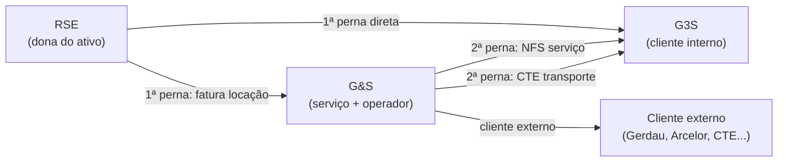
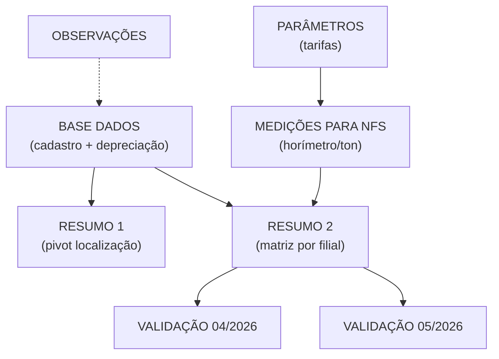

---
tags:
  - note
  - controladoria
  - intercompany
  - maquinas
  - G3S
  - RSE
atualizado: 11/06/2026
---
11/06/2026 - 10:00

# ~={Titulo}Planilha Entre Empresas — Faturamento de Máquinas Intercompany=~

> Documentação da planilha `02-Referencias/Custos-Maquinas/Entre Empresas Abril 2026.xlsx`.
> Controle e faturamento **intercompany** de máquinas, veículos e equipamentos entre **RSE**, **G&S** e **G3S**, com foco no fechamento de **abril/2026**.

---

## ~={Titulo}Visão geral=~

A planilha registra a cadeia de cobrança de ativos do grupo:

| Empresa | Papel na cadeia |
|---|---|
| **RSE** | Dona dos ativos (máquinas, caminhões, balanças, prensas etc.) |
| **G&S (G8S)** | Aluga da RSE e presta serviço com mão de obra |
| **G3S (Seletiva)** | Cliente interno que recebe máquina + operador |

Isso segue a cadeia descrita em [[Estrutura Empresarial G3S]]: ==RSE → G&S → G3S==, com lançamentos no CC **1.10.1 / 2.10.1** ([[Divisões (nível 1)]]) e contas como **5.4.7** e **7.11.1** ([[Tipos de Movimentação]]).

A planilha serve para:

1. Cadastrar cada ativo e sua cadeia de cobrança (“pernas”)
2. Calcular o valor mensal de locação (depreciação)
3. Registrar medições por horímetro/tonelada para NFS da G&S
4. Consolidar quanto cada filial deve pagar/receber
5. Validar se o faturamento bate com CTEs, NFS externas e medições

**Escala da base (aba BASE DADOS):** ~90 ativos (48 máquinas, 42 veículos), quase todos da RSE, com soma de depreciação mensal de ~==R$ 2,58 mi==.

---

## ~={Titulo}Fluxo conceitual — as “pernas”=~

| Perna | Significado |
|---|---|
| **1ª perna** | RSE fatura para G&S ou G3S (locação fixa por depreciação) |
| **2ª perna** | G&S fatura para G3S (serviço por hora/tonelada) ou emite CTE |
| **3ª perna** | Tipo do documento da 2ª perna (`CTE`, `NFS`, `POR TONELADA`, etc.) |

#### ~={Titulo}Distribuição típica na 1ª perna=~

| 1ª perna | Qtd. aprox. |
|---|---|
| `RSE para G&S correspondente` | 49 ativos |
| `RSE para G3S correspondente` | 17 ativos |
| `RSE para G&S Barueri` | 11 ativos |
| `RSE para G3S 5` | 9 ativos |
| Demais (cliente direto, uso interno G3S) | poucos casos |

**Tipos de operação:** 68 ==SERVIÇO== (cobrança variável por hora/ton) e 22 ==LOCAÇÃO== (valor fixo mensal).

---

## ~={Titulo}As 8 abas=~

### ~={blue}1. BASE DADOS=~ — cadastro mestre

**90 linhas × 34 colunas.** Uma linha por ativo (placa/código). Núcleo da planilha.

| Bloco | Campos principais |
|---|---|
| Identificação | ID, status, localização, placa, tipo, marca, modelo, implemento |
| Cadeia de cobrança | 1ª / 2ª / 3ª “perna”, proprietário, nº contrato, locação ou serviço |
| Precificação | Preços de compra (equipamento, veículo, rollon, garra…), ∑ conjunto, vida útil, payback |
| Valor mensal | `VALOR DA LOCAÇÃO (DEPRECIAÇÃO)` = custo mensal da 1ª perna |
| Controle de faturamento | Status por mês (março/abril/maio 2026), emissão NFS 2ª perna, valor das medições |
| Observações | `CONTRATO OK`, pendências da controladoria |

> ⚠️ A primeira coluna (`ESCAVADEIRA COM GARRA DINAM`) na prática é o **ID sequencial** do ativo, não uma descrição fixa de equipamento.

---

### ~={blue}2. PARÂMETROS=~ — tabela de preços por tipo de máquina

**42 tipos** de equipamento com regras de cobrança:

| Coluna | Significado |
|---|---|
| `LOCAÇÃO FIXA E MENSAL` | Valor fixo (ex.: balança R$ 2.083/mês, caminhão 3/4 R$ 8.500) |
| `HORA-MAQUINA` | Tarifa por hora (ex.: escavadeira Liebherr R$ 512/h) |
| `TONELADA PROCESSADA` | Tarifa por ton (ex.: prensa móvel R$ 100/t) |
| `DIAS/MÊS`, `HORAS/DIA`, `HORAS/MÊS` | Premissas de capacidade (padrão 22 dias × 7 h) |
| `CAPACIDADE DE PRODUÇÃO (100%)` | Teto teórico mensal |

Tabela de referência usada na aba de medições e nos cálculos de NFS.

---

### ~={blue}3. MEDIÇÕES PARA NFS - G&S=~ — apuração operacional

Registro de **medições reais** para emissão de NFS de serviço da G&S:

- Horímetro inicial/final, horas/dia, horas/mês
- Toneladas processadas (prensas)
- Competência (abril e maio/2026)
- `VALOR A FATURAR` calculado

Também traz bloco de **CTEs emitidos em março/2026** por filial G&S (Prudente, Dourados, Londrina, Maringá) para cruzamento.

Ponte entre **produção no chão** e **nota fiscal de serviço** da G&S para a G3S.

---

### ~={blue}4. RESUMO 1=~ — visão analítica (estilo pivot)

Soma `VALOR DA LOCAÇÃO (DEPRECIAÇÃO)` por:

- Unidade operacional (localização física)
- “Perna” de faturamento (RSE → G&S, RSE → G3S, etc.)

**Total geral: R$ 1.292.062,50** — metade da soma bruta da base (agrupa sem duplicar pernas ou filtra por visão específica).

---

### ~={blue}5. RESUMO 2=~ — matriz de faturamento por filial

Dois blocos temporais: **abril/2026** e **maio/2026**.

| Seção | O que mostra |
|---|---|
| RSE a receber G3S | Quanto cada filial G3S (01, 03, 04, 05, 06, 08) deve à RSE |
| RSE a receber G&S | Quanto cada filial G&S deve à RSE |
| RSE a receber GERDAU | Locações diretas para cliente externo |
| **Total faturas locação RSE** | Abr: **R$ 1.156.345,85** / Mai: **R$ 1.184.362,52** |
| G&S a receber G3S | NFS de medições por filial G3S |
| **Total NFS serviços G&S** | Abr: **R$ 838.748,78** / Mai: **R$ 794.456,21** |

Demonstrativo consolidado do que cada empresa deve faturar/receber, por CNPJ/filial.

---

### ~={blue}6. VALIDACÃO RECEITAS G&S  04.2026=~

Conferência do faturamento da **G&S em abril/2026**:

**G&S (receitas):**

| Fonte | Valor |
|---|---|
| CTEs (transporte interno) | R$ 257.912,10 |
| NFS clientes externos (Barueri) | R$ 624.595,97 |
| NFS G3S (medições) | R$ 838.748,78 |
| **Total G&S** | **R$ 1.721.256,85** |

**RSE (receitas):**

| Fonte | Valor |
|---|---|
| Locação clientes externos | R$ 93.786,02 |
| Faturas G3S/G&S | R$ 1.156.345,85 |
| **Total RSE** | **R$ 1.250.131,87** |

Inclui demonstrativo trimestral (jan–mar/2026) com diferença de **R$ 391** em março (marcado com `**`).

---

### ~={blue}7. VALIDACÃO RECEITAS G&S  05.2026=~

Mesma estrutura para **maio/2026**:

| Empresa | Total |
|---|---|
| G&S | R$ 1.713.281,02 |
| RSE | R$ 1.266.903,99 |

O bloco do 2º trimestre ainda está parcialmente em branco (projeção/abertura do mês).

---

### ~={blue}8. OBSERVAÇÕES=~ — notas de processo e reuniões

Anotações operacionais relevantes:

- Enviar faturas/NFS/CTEs para Prado e Ossucci conferirem lucro da G&S
- ~={yellow}“G&S dá lucro (Lucro Real), mas lucro somente na RSE”=~
- Validação de ativos/caminhões com Marcondes
- Regras de fechamento: medições até dia **25**; envio dia **26** (Gisele → Andressa)
- Prensa móvel: fechamento 26 a 25; R$ 100/tonelada
- Escavadeiras: cobrança por hora conforme produção
- G3S tratada como “cliente externo” formalizado (contrato, reajuste, aditivo)

---

## ~={Titulo}Como as abas se relacionam=~

---

## ~={Titulo}Resumo rápido=~

| Pergunta | Resposta |
|---|---|
| **Do que se trata?** | Controle de locação e serviço de máquinas/veículos **entre empresas do grupo** (RSE ↔ G&S ↔ G3S), com foco no fechamento de **abril/2026** |
| **Para que serve?** | Garantir que cada “perna” da cadeia seja faturada corretamente, com valores coerentes entre depreciação, medições e documentos (fatura, NFS, CTE) |
| **Onde está o detalhe?** | `BASE DADOS` (ativo a ativo) e `MEDIÇÕES` (produção real) |
| **Onde está o consolidado?** | `RESUMO 2` (por filial) e abas de `VALIDAÇÃO` (totais por empresa) |
| **O que falta amarrar?** | Várias pendências em `OBSERVAÇÕES` e status “NÃO” em faturas de março na base |

> ⚠️ Na consolidação do grupo, o saldo de `1.10.1` deve zerar contra `2.10.1` — ver [[Analise Base Financeira]] e [[Divisões (nível 1)]].

___

[[Estrutura Empresarial G3S]] · [[Divisões (nível 1)]] · [[Tipos de Movimentação]] · [[Analise Base Financeira]] · [[qtd de máquinas por filial]] · [[Premissas - Fechamento]] · [[Índice Controladoria]]
