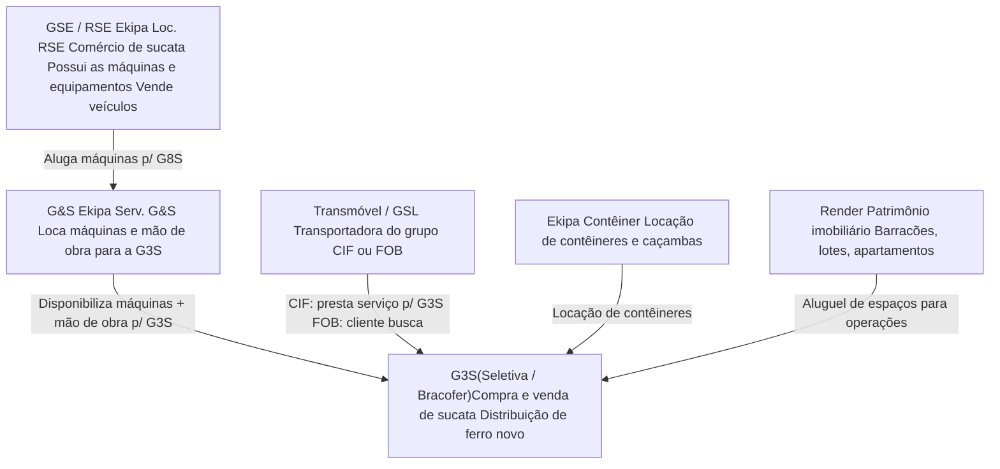
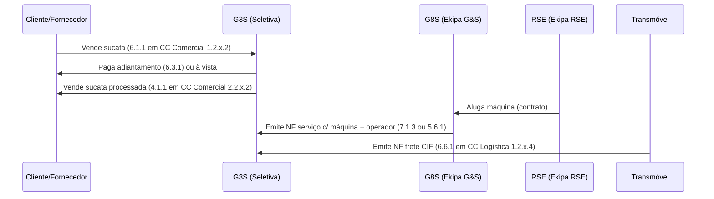

---
tags:
  - note
  - controladoria
  - estrutura
  - G3S
  - empresas
---
25/03/2026 - 09:00

# ~={Titulo}Estrutura Empresarial — Grupo G3S=~

> Nota de contextualização sobre a relação entre as empresas e CNPJs que atuam em conjunto no grupo.
> Baseada em explicações do gestor + estrutura do [[00 - Índice Controladoria]].

---

## Visão Geral

O grupo opera com **múltiplos CNPJs** que funcionam de forma integrada: cada empresa tem uma função específica, e elas se prestam serviços mutuamente. O sistema que registra tudo isso é o ==SAGI== (sucata, locações, NF da G8S) e o ==ATUA== (Transmóvel/GSL).

---

## ~={Titulo}Mapa das Empresas=~

---

## ~={Titulo}Detalhamento por Empresa=~

### 🏭 G3S — Seletiva / Bracofer
**CNPJ principal:** 20.947.332/0004-38  
**Sistema:** SAGI

| Divisão | Nome Fantasia | Atividade |
|---|---|---|
| Seletiva | G3S | Compra, processa e vende sucatas metálicas |
| Bracofer | Bracofer | Distribui ferro novo (barras, perfis, corte e dobra) |

- É a **empresa-âncora** do grupo: a maior parte dos lançamentos está aqui.
- O SAGI é conectado em CNPJ da G3S. A filial ativa no canto direito superior da tela do SAGI (ex: `G3S PRUDENTE`) indica qual estabelecimento está operando.
- → **CCs:** `1.2` / `2.2` (Seletiva), `1.3` / `2.3` (Bracofer)

---

### 🏗️ G&S — Ekipa Locações e Serv. G&S
**Sistema:** SAGI (NF de serviço emitida pela G&S)

- Loca **máquinas e mão de obra** para a G3S/Seletiva e para clientes siderúrgicos externos (Arcelor, Gerdau, Tupy).
- Não possui os ativos: aluga da RSE/GSE e repassa com mão de obra operacional.
- Contratos externos ficam sob o CC `1.7` (despesa) e `2.7` (receita).
- → **CCs:** `1.7` / `2.7`

---

### 🔧 GSE / RSE — Ekipa Locações RSE
**Sistema:** SAGI

- ==Quem possui as máquinas e equipamentos pesados do grupo== (escavadeiras, prensas, caminhões pesados).
- Aluga esses ativos para a G8S (que repassa para a G3S com operadores) e executa compras/vendas de veículos.
- Frota com ~50 ativos rastreados individualmente no SAGI (código de placa = código do CC).
- → **CCs:** `1.6` / `2.6`

> 💡 Relação: `RSE` possui ativo → aluga para `G8S` → `G8S` disponibiliza com mão de obra para `G3S`.

---

### 🚛 Transmóvel / GSL — Transmove GSL
**Sistema:** ATUA (sistema separado, integrado com SAGI para notas)

- Transportadora do grupo. Dois modelos de operação:
  - **CIF** (*Cost, Insurance and Freight*): a Transmóvel coleta/entrega — ela ==presta serviço para a G3S==.
  - **FOB** (*Free on Board*): o cliente/fornecedor busca com transporte próprio — a Transmóvel não participa.
- Quando CIF, a Transmóvel emite nota de serviço de transporte para a G3S.
- Filiais: Presidente Prudente · Dourados · Maringá · Barueri
- → **CCs:** `1.4` / `2.4`

---

### 📦 Ekipa Contêiner
**Sistema:** SAGI

- Locação de contêineres e caçambas.
- Opera apenas em Presidente Prudente.
- → **CCs:** `1.5` / `2.5`

---

### 🏠 Render Locações
**Sistema:** SAGI

- Portfólio imobiliário do grupo: barracões, pátios, apartamentos, salas, sítios.
- Receitas imobiliárias (aluguéis) e despesas (IPTU, condomínio, ITR).
- → **CCs:** `1.8` / `2.8`

---

## ~={Titulo}Fluxo Financeiro Simplificado=~

---

## ~={Titulo}Como Identificar a Empresa no SAGI=~

| O que você vê | O que significa |
|---|---|
| Filial `G3S PRUDENTE` no canto superior direito | Você está conectado na filial de Presidente Prudente da G3S Seletiva |
| CC começando em `1.6` ou `2.6` | Lançamento na RSE (Ekipa Loc. RSE) |
| CC começando em `1.7` ou `2.7` | Lançamento na G8S (Ekipa Serv. G&S) — contratos externos |
| CC começando em `1.4` ou `2.4` | Lançamento na Transmóvel (GSL) |
| CC começando em `1.8` ou `2.8` | Lançamento imobiliário (Render) |
| CC começando em `1.9` ou `2.9` | Lançamento familiar (sócios — atenção!) |

---

## ~={Titulo}Gerencial vs. Filiais no SAGI=~

O gestor explicou a separação em dois níveis:

- **Sintético:** agrupa, não recebe lançamento direto (ex: `1 DESPESA`, `1.2 SELETIVA`, `1.2.5 PRESIDENTE PRUDENTE`)
- **Analítico:** folha da hierarquia, recebe o lançamento (ex: `1.2.5.2 COMERCIAL`, `1.2.5.6.1 EWU6003`)

A tela de **Troca de Plano de Conta / CC em Lote** no SAGI exibe ambos os tipos, mas só os analíticos recebem transferências reais.

---

___

[[Divisões]] · [[Filiais]] · [[Guia SAGI]] · [[00 - Índice Controladoria]]
